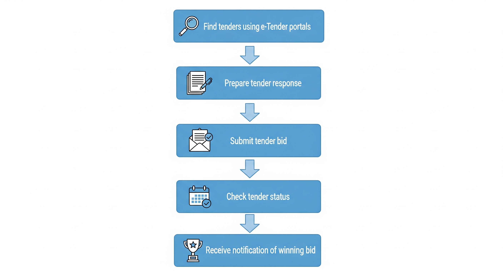
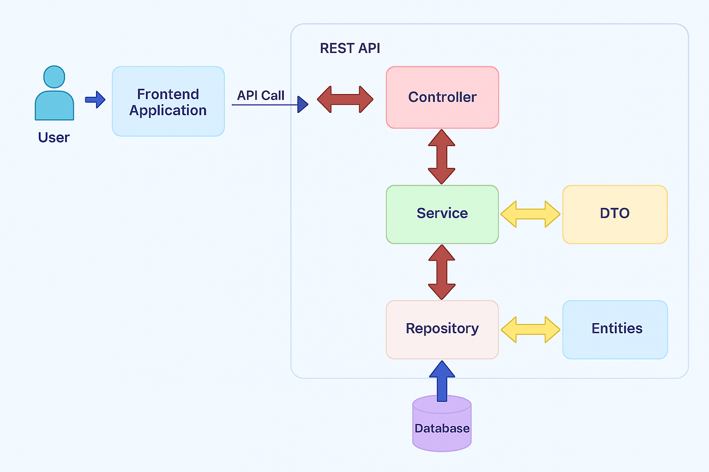

<h1 align="center">E-logistics Tendering</h1>

<p align="center">

</p>


<br>

###  What is E-logistics Tendering ?


**E-logistics Tendering** is an online platform that simplifies how logistics companies work together. It helps Third-Party Logistics (3PL) providers and Logistics Service Providers (LSPs) connect, communicate, and manage transportation jobs more efficiently. With ELogistics-Tendering, everything happens digitally, from creating transport requests to tracking shipments—saving time, reducing paperwork, and making the entire process smoother for everyone involved.



<br>


## 📖 Table of contents

- [Features](#features)
- [Project Structure](#file_folder-project-structure)
- [Architecture](#architecture)
- [Setup and Installation](#setup-and-installation)
- [API Endpoints](#api-endpoints)

<br>

##  Features

-  📝 **3PL & LSP Integration**  
  Effortlessly connect 3PL providers with LSPs to improve coordination and workflow.

-  💻 **Digital Tendering Process**  
  Fully digital system for creating, submitting, and managing transportation service tenders.

-  📊 **Bid Management**  
  Streamlined and transparent bid handling—from creation through to selection and negotiation.

-  📍 **Real-Time Tracking**  
  Live monitoring of shipment locations and delivery statuses.

-  ✅ **Confirmation & Acknowledgment**  
  Simplified confirmation of transport agreements with performance tracking and accountability.

<br>

## :file_folder: Project Structure


```
.
src/
└── main/
    ├── java/
    │   └── tendering/
    │       ├── config/              
    │       ├── controller/          
    │       ├── dto/                 
    │       ├── exception/          
    │       ├── kafka/               
    │       ├── model/               
    │       ├── repository/         
    │       ├── service/             
    │       └── TenderingApplication.java  
    │
    └── resources/
        ├── application.properties 
        └── ...                      

```

<br>

##  Architecture




<br>

## 🛠️ Tech Stack

- **Language**: Java 21
- **Framework**: Spring Boot 3.4.5
- **Build Tool**: Maven
- **Database**: MySQL 8.0
- **Messaging**: Apache Kafka
- **Notifications**: Firebase Admin SDK
- **Communication**: Twilio SDK (SMS)
- **Logging**: Log4j2
- **Testing**: Spring Boot Test (JUnit)
- **Dev Tools**: Spring Boot DevTools

<br>
<br>

## Setup and Installation

<br>

  ###   Prerequisites

  Ensure the following are installed on your system:
  
  - ☕ Java 21 
  
  - 🔧 Maven 3.8+
  
  - 🐬 MySQL 8+
  
  - 📨 Apache Kafka 3.x
  
  - 🧰 Git

 <br>

### Installation

<br>

**Step 1: Clone the repository**

<br>

```
git clone https://github.com/kundansinghdev/ELogistics-Tendering.git
cd ELogistics-Tendering
```

<br>

**Step 2:  Configure the database**

<br>

Create a MySQL database and update your credentials in src/main/resources/application.properties:

<br>

```
spring.datasource.url=jdbc:mysql://localhost:3306/your_database_name
spring.datasource.username=your_db_user
spring.datasource.password=your_db_password
```
<br>

**Step 3: Start Kafka and Zookeeper**

<br>

Make sure Zookeeper and Kafka are running on localhost:2181 and localhost:9092 respectively.

Build the project:

<br>

```
mvn clean install
```

<br>

**Step 4: Run the application**

<br>

```
mvn spring-boot:run
```

<br>

Once started, the application will be available at:
<br>
```
http://localhost:9090/
```
<br>

✅ Verify Setup

Check console logs for:
<br>
```
Tomcat started on port 9090
Started ELogisticsTenderingApplication
```
<br>

If you see these, the application has started successfully.

<br>
<br>

## API Endpoints


### Auth

| Method | Endpoint                                                  | Description                      |
| ------ | --------------------------------------------------------- | -------------------------------- |
| GET    | [`/auth/ping`](#-get-authping)                            | Server health check              |
| POST   | [`/auth/signup`](#-post-authsignup)                       | Initiates signup by sending OTP  |
| POST   | [`/auth/verify-signup-otp`](#-post-authverify-signup-otp) | Verifies OTP and creates account |
| POST   | [`/auth/login`](#-post-authlogin)                         | Login via email and password     |
| POST   | [`/auth/login-with-mobile`](#-post-authlogin-with-mobile) | Sends OTP for mobile login       |
| POST   | [`/auth/verify-otp`](#-post-authverify-otp)               | Verifies OTP and logs in user    |

<br>

### Password Reset

| Method | Endpoint                                                            | Description                                |
| ------ | ------------------------------------------------------------------- | ------------------------------------------ |
| POST   | [`/auth/request-password-reset`](#-post-authrequest-password-reset) | Sends OTP to email for password reset      |
| POST   | [`/auth/verify-reset-otp`](#-post-authverify-reset-otp)             | Verifies password reset OTP                |
| POST   | [`/auth/reset-password`](#-post-authreset-password)                 | Sets a new password after OTP verification |

<br>

### User List

| Method | Endpoint                       | Description                                     |
| ------ | ------------------------------ | ----------------------------------------------- |
| GET    | [`/users/all`](#-get-usersall) | Retrieves all users                             |
| GET    | [`/users/lsp`](#-get-userslsp) | Retrieves all LSP (Logistics Service Providers) |
| GET    | [`/users/3pl`](#-get-users3pl) | Retrieves all 3PL (Third-Party Logistics) users |

<br>

### LSP Tender Responses

| Method | Endpoint                                                                        | Description                            |
| ------ | ------------------------------------------------------------------------------- | -------------------------------------- |
| GET    | [`/api/lsp/responses`](#-get-apilspresponses)                                   | Get LSP responses by company           |
| PUT    | [`/api/lsp/responses/reply/{tenderNo}`](#-put-apilspresponsesreplytenderno)     | Submit reply to tender                 |
| POST   | [`/api/lsp/responses/filter`](#-post-apilspresponsesfilter)                     | Filter responses by company & status   |
| POST   | [`/api/lsp/responses/filter-by-tender`](#-post-apilspresponsesfilter-by-tender) | Filter responses by tender and company |

<br>

#### Tender Management (3PL)

| Method | Endpoint                                         | Description                        |
| ------ | ------------------------------------------------ | ---------------------------------- |
| POST   | [`/3PL/tenders/create`](#-post-3pltenderscreate) | Create a new tender                |
| POST   | [`/3PL/tenders/search`](#-post-3pltenderssearch) | Search tenders by company & status |

<br>
<br>

## Auth

Handles user registration, login, and OTP-based authentication.

<br>

#### `GET /auth/ping`

- **Purpose**: Health check endpoint
- **Response**:

```
ELogisticsTendering is up and running.
```

<br>

#### `POST /auth/signup`

- **Purpose**: Initiates the signup process by sending an OTP to the user's mobile
- **Request Body** (`application/json`):

```json
{
  "companyName": "Acme Inc",
  "email": "admin@acme.com",
  "mobileNumber": "9876543210",
  "password": "StrongPassword123"
}
```

**Responses**:

- `201 Created`: OTP sent successfully

- `409 Conflict`: User already exists

- `400 Bad Request`: Validation error

- `500 Internal Server Error`: Unexpected failure
  
<br>

#### `POST /auth/verify-signup-otp`

- **Purpose**: Verifies OTP and completes account creation

- **Request Body** (`application/json`):

```json
{
  "mobileNumber": "9876543210",
  "otp": "123456"
}
```

**Responses**:

- `200 OK`: Account created

- `400 Bad Request`: Invalid OTP or input

- `500 Internal Server Error`: Server error

<br>

#### `POST /auth/login`

- **Purpose**: Logs in the user using email and password

- **Request Body** (`application/json`):

```json
{
  "email": "admin@acme.com",
  "password": "StrongPassword123"
}
```

**Responses**:

- `200 OK`: Login successful

- `401 Unauthorized`: Incorrect password

- `404 Not Found`: Email not registered

- `500 Internal Server Error`: Login error

<br>

#### `POST /auth/login-with-mobile`

- **Purpose**: Sends OTP to the user's registered mobile for login

- **Request Body** (`application/json`):

```json
{
  "mobileNumber": "9876543210"
}
```

**Responses**:

- `200 OK`: OTP sent

- `404 Not Found`: Mobile number not registered

- `500 Internal Server Error`: Sending OTP failed

  <br>

#### `POST /auth/verify-otp`

- **Purpose**: Verifies OTP and logs in the user via mobile

- **Request Body** (`application/json`):

```json
{
  "mobileNumber": "9876543210",
  "otp": "123456"
}
```

**Responses**:

- `200 OK`: Login successful

- `400 Bad Request`: Invalid OTP

- `500 Internal Server Error`: Verification failed

<br>
<br>

## PasswordReset

Handles password reset via email and OTP.

<br>

#### `POST /auth/request-password-reset`

- **Purpose**: Initiates a password reset by sending an OTP to the user's registered email.
- **Request Body** (`application/json`):

```json
{
  "email": "user@example.com"
}
```

**Responses**:

- `200 OK`: OTP sent to email

- `400 Bad Request`: Invalid or unregistered email

- `500 Internal Server Error`: Failed to send OTP

  <br>

#### `POST /auth/verify-reset-otp`

- **Purpose**: Verifies the OTP sent to the user's email before resetting the password.

- **Request Body** (`application/json`):

```json
{
  "email": "user@example.com",
  "otp": "123456"
}
```

**Responses**:

- `200 OK`: OTP verified

- `400 Bad Request`: Invalid OTP

- `500 Internal Server Error`: Verification failed

  <br>

#### `POST /auth/reset-password`

- **Purpose**: Sets a new password after OTP verification.

- **Request Body** (`application/json`):

```json
{
  "email": "user@example.com",
  "newPassword": "NewPassword123",
  "confirmPassword": "NewPassword123"
}
```

**Responses**:

- `200 OK`: Password reset successful

- `400 Bad Request`: Passwords don't match or validation failed

- `500 Internal Server Error`: Password reset failed

<br>
<br>

## User List

Provides APIs to fetch user lists based on roles.

<br>

#### `GET /users/all`

- **Purpose**: Retrieves all registered users.
- **Responses**:
  - `200 OK`: Returns a list of all users
  - `500 Internal Server Error`: Fetching failed

<br>

#### `GET /users/lsp`

- **Purpose**: Retrieves all users with the role `LSP` (Logistics Service Providers).
- **Responses**:
  - `200 OK`: List of LSP users
  - `500 Internal Server Error`: Fetching failed

<br>

#### `GET /users/3pl`

- **Purpose**: Retrieves all users with the role `3PL` (Third-Party Logistics Providers).
- **Responses**:
  - `200 OK`: List of 3PL users
  - `500 Internal Server Error`: Fetching failed

<br>
<br>

## LSP Responses

Manages responses from Logistics Service Providers (LSP) to tenders.

<br>

#### `GET /api/lsp/responses?companyName=AcmeLogistics`

- **Purpose**: Fetch all responses submitted by a specific company.
- **Query Param**:
  - `companyName` (string): Name of the LSP company.
- **Responses**:
  - `200 OK`: List of responses.
  - `204 No Content`: No responses found for the company.

<br>

#### `PUT /api/lsp/responses/reply/{tenderNo}?companyName=AcmeLogistics`

- **Purpose**: Submit or update a tender reply by the LSP.
- **Path Variable**:
  - `tenderNo` (string): Unique identifier of the tender.
- **Query Param**:
  - `companyName` (string): Name of the LSP company.
- **Request Body** (`application/json`):

```json
{
  "bidPrice": 25000,
  "estimatedArrivalDate": "2025-09-01",
  "lspMessage": "We can deliver ahead of schedule."
}
```

- **Responses**:

- `200 OK`: Reply submitted successfully.

- `404 Not Found`: Tender not found for the company.

  <br>

#### `POST /api/lsp/responses/filter`

- **Purpose**: Filter LSP responses by company and status.

- **Request Body** (`application/json`):

```json
{
  "companyName": "AcmeLogistics",
  "status": "PENDING"
}
```

- Allowed status values: `PENDING`, `INPROCESS`, `COMPLETED`

- **Responses**:

- `200 OK`: List of filtered responses or a message if none found.

- `400 Bad Request`: Invalid status value.

  <br>

#### `POST /api/lsp/responses/filter-by-tender`

- **Purpose**: Fetch responses to a particular tender made by a specific company.

- **Request Body** (`application/json`):

```json
{
  "companyName": "MegaCorp",
  "tender_no": "TDR123"
}
```

- **Responses**:

- `200 OK`: List of LSP responses with fields: `lspCompanyName`, `bidPrice`, `estimatedArrivalDate`, `lspMessage`

<br>
<br>

## Tender Management

APIs for creating and retrieving tenders submitted by 3PL companies.

<br>

#### `POST /3PL/tenders/create?companyName=MegaLogistics`

- **Purpose**: Creates a new tender for a 3PL company.
- **Query Parameter**:
  - `companyName` (string): Name of the company creating the tender.
- **Request Body** (`application/json`):

```json
{
  "tenderTitle": "Freight for North India",
  "description": "Need refrigerated trucks for food delivery",
  "origin": "Delhi",
  "destination": "Chandigarh",
  "departureDate": "2025-09-01",
  "arrivalDate": "2025-09-02"
}
```

- **Responses**:

- `201 Created`: Tender successfully created.

- `400 Bad Request`: Invalid data or creation failure.

<br>

#### `POST /3PL/tenders/search`

- **Purpose**: Retrieves tenders created by a company based on their status.

- **Request Body** (`application/json`):

```json
{
  "companyName": "MegaLogistics",
  "status": "ACTIVE"
}
```

- Allowed status values: `ACTIVE`, `PENDING`, `COMPLETED`

- **Responses**:

- `200 OK`: List of matching tenders or message if none found.

- `400 Bad Request`: Invalid status input.

- `404 Not Found`: No tenders found for the given company and status.


